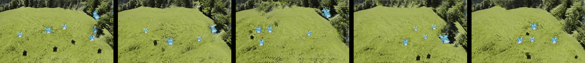

# Hierarchical Patch VAE-GAN2
Official repository of the paper "Hierarchical Patch VAE-GAN: Generating Diverse Videos from a Single Sample"([link](https://arxiv.org/abs/2006.12226))

Real Videos


<br><br><br><br><br><br>

Fake Videos



<br><br><br><br><br><br>

 ## Environment setting
Use commands in ```env.sh``` to setup the correct conda environment

## Training Video
For training a single video, use the following command for example:

```CUDA_VISIBLE_DEVICES=0 python train_video.py --video-path data/vids/air_balloons.mp4 --vae-levels 3 --checkname myvideotest --visualize```

Common training options:
```
# Networks Hyper Parameters
--nfc                model basic # channels
--latent-dim         Latent dim size
--vae-levels         # VAE levels
--generator          generator mode

# Optimization hyper parameters
--niter              number of iterations to train per scale
--rec-weight         reconstruction loss weight
--train-all          train all levels w.r.t. train-depth

# Dataset
--video-path         video path (required)
--start-frame        start frame number
--max-frames         # frames to save
--sampling-rates     sampling rates

# Misc
--visualize     visualize using tensorboard
```

## Training Image
For training a single video, use the following command for example:

```CUDA_VISIBLE_DEVICES=0 python train_image.py --image-path data/imgs/air_balloons.jpg --vae-levels 3 --checkname myimagetest --visualize```

## Training baselines for video
For training a single video using SinGan re-implementation, use the following command:

```CUDA_VISIBLE_DEVICES=0 python train_video_baselines.py --video-path data/vids/air_balloons.mp4 --checkname myimagetest --visualize --generator GeneratorSG --train-depth 1```
